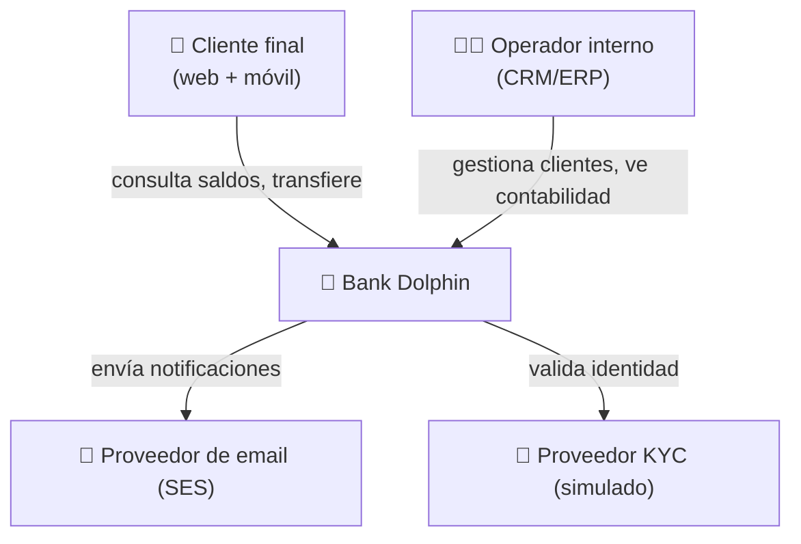
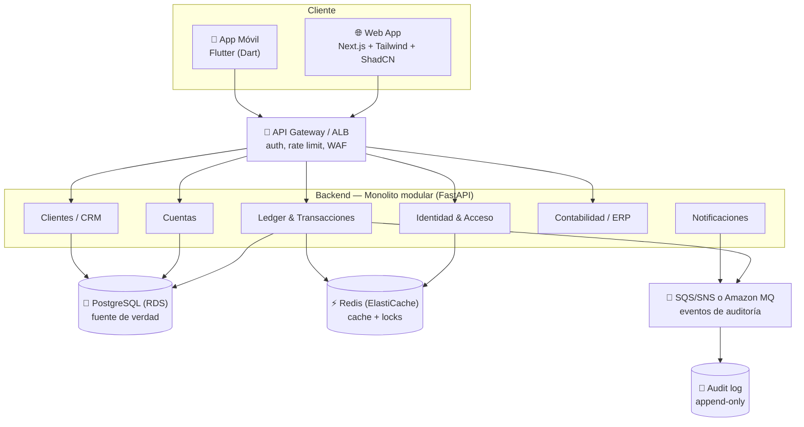
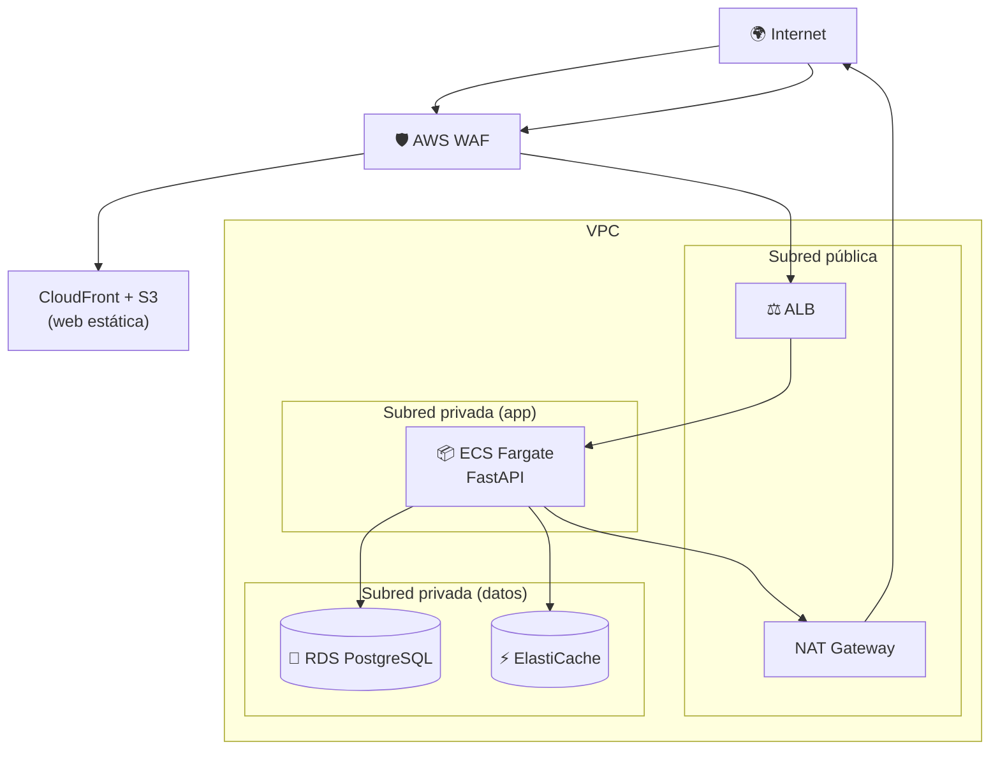

# Arquitectura — Bank Dolphin 🐬

> Documento vivo de arquitectura. Versión 0.4 — base para iterar por fases.
> Autor: Diego — desarrollo en solitario (full-stack + infra + seguridad).
> Nube objetivo: **AWS**. Enfoque de seguridad: **riguroso**, con pruebas en laboratorio controlado.

---

## 1. Visión y alcance

Construir un **sistema bancario demo** de calidad profesional que combine un **core transaccional**, **CRM** y **ERP/contabilidad**, desplegado en AWS, con seguridad de nivel bancario y apps web + móvil.

**Lo que NO es:** un banco real con dinero real. No buscamos licencia CNBV ni operar fondos. Es un sistema demostrable de extremo a extremo.

**Lo que SÍ demuestra ante un reclutador:**
- Sé diseñar un sistema transaccional correcto (ledger de doble partida, ACID, idempotencia).
- Sé proteger datos sensibles y endurecer infraestructura en la nube.
- Sé separar dominios y mantener un código limpio y escalable.
- Sé llevarlo a AWS con CI/CD, IaC y observabilidad.
- Sé auditar la seguridad de mi propio sistema con metodología.
- Construyo UX pulida tanto en web como en móvil.

**Realidad del solo dev:** el alcance es amplio para una persona. La estrategia es que **cada fase quede terminada y demostrable antes de avanzar**. Mejor un core impecable que seis módulos a medias.

---

## 2. Principios de diseño

1. **La verdad financiera vive en un ledger de doble partida.** Los saldos se *derivan*, nunca se mutan a mano.
2. **Toda operación financiera es idempotente y auditable.** Reintentar no duplica; nada se borra, solo se agrega.
3. **Monolito modular primero, microservicios después (si hace falta).** Fronteras de dominio claras desde el día uno.
4. **Seguridad por defecto.** Menor privilegio, cifrado en reposo y tránsito, secretos fuera del repo, todo verificable.
5. **Contratos antes que implementación.** Diseñar las APIs (OpenAPI) antes de codear.
6. **Todo como código.** Infra (Terraform), pipelines (GitHub Actions) y políticas de seguridad versionadas.

---

## 3. Dominios (bounded contexts)

| Dominio | Responsabilidad | Fase |
|---|---|---|
| **Identidad & Acceso** | Registro, login, MFA, tokens, RBAC/ABAC | 1 |
| **Cuentas** | Apertura de cuentas, tipos de producto, estados | 1 |
| **Ledger & Transacciones** | Asientos de doble partida, transferencias, idempotencia | 2 ⭐ |
| **Clientes (CRM)** | Perfil, onboarding, KYC, segmentación, tickets | 3 |
| **Contabilidad (ERP)** | Plan de cuentas, conciliación, cierre, reportes | 4 |
| **Notificaciones** | Email/push de movimientos y alertas | 3-4 |
| **Antifraude** *(opcional)* | Scoring de transacciones anómalas (ML) | 7 |

Cada dominio = un módulo con su propia lógica, comunicado por interfaces explícitas.

---

## 4. Vista C4 — Nivel 1: Contexto



## 5. Vista C4 — Nivel 2: Contenedores



---

## 6. El núcleo: ledger de doble partida

Esta es la parte que separa un proyecto bancario serio de un CRUD disfrazado.

**Regla de oro:** cada transacción genera ≥2 asientos (`entries`) que **suman exactamente cero**. El saldo de una cuenta es la suma de sus asientos, no un campo editable.

### Modelo de datos (simplificado)

```sql
-- Cuentas contables (del cliente y también internas del banco)
CREATE TABLE accounts (
    id              UUID PRIMARY KEY DEFAULT gen_random_uuid(),
    owner_id        UUID,                          -- cliente, o NULL si es cuenta interna
    type            TEXT NOT NULL,                 -- 'checking', 'savings', 'internal_cash', ...
    currency        CHAR(3) NOT NULL DEFAULT 'MXN',
    status          TEXT NOT NULL DEFAULT 'active',
    created_at      TIMESTAMPTZ NOT NULL DEFAULT now()
);

-- Una transacción agrupa varios asientos que deben cuadrar a cero
CREATE TABLE transactions (
    id              UUID PRIMARY KEY DEFAULT gen_random_uuid(),
    idempotency_key TEXT UNIQUE NOT NULL,          -- evita duplicados al reintentar
    description     TEXT,
    created_at      TIMESTAMPTZ NOT NULL DEFAULT now()
);

-- Los asientos. Los montos se guardan en centavos (entero), nunca float
CREATE TABLE entries (
    id              BIGSERIAL PRIMARY KEY,
    transaction_id  UUID NOT NULL REFERENCES transactions(id),
    account_id      UUID NOT NULL REFERENCES accounts(id),
    amount          BIGINT NOT NULL,               -- + crédito / - débito, en centavos
    created_at      TIMESTAMPTZ NOT NULL DEFAULT now()
);

-- El saldo es derivado, no almacenado:
-- SELECT COALESCE(SUM(amount), 0) FROM entries WHERE account_id = $1;
```

### Ejemplo: transferencia de $100.00 de Ana a Beto

```
transaction: "Transferencia Ana → Beto"
  entry 1: account=Ana   amount=-10000   (débito)
  entry 2: account=Beto  amount=+10000   (crédito)
  ───────────────────────────────────────
  SUMA = 0  ✅  (si no cuadra, la transacción se rechaza)
```

### Garantías técnicas
- **ACID:** la inserción de `transaction` + sus `entries` ocurre en una sola transacción de PostgreSQL.
- **Concurrencia:** `SELECT ... FOR UPDATE` sobre las cuentas implicadas, o aislamiento `SERIALIZABLE`.
- **Idempotencia:** el cliente manda un `idempotency_key`; si ya existe, devolvemos la transacción previa.
- **Inmutabilidad:** los `entries` nunca se editan ni borran. Un error se corrige con un asiento de reversa.

---

## 7. Stack de aplicación

| Capa | Tecnología | Por qué |
|---|---|---|
| Web | Next.js + TypeScript + Tailwind + ShadCN | SSR, componentes listos, ecosistema maduro de UI bancaria |
| Móvil | Flutter (Dart) | Android + iOS con un solo código; soporte oficial en Android Studio |
| API | FastAPI (Python) | Dominio propio, tipado con Pydantic, OpenAPI gratis |
| Base de datos | PostgreSQL | Transaccional, ACID, robusto |
| Cache / locks | Redis | Sesiones, rate limit, locks distribuidos |
| Mensajería | SQS/SNS (o Amazon MQ) | Eventos de auditoría y notificaciones asíncronas |
| Contenedores | Docker | Reproducibilidad |
| IaC | Terraform | Infra versionada |
| CI/CD | GitHub Actions | Repo en GitHub |

---

## 8. Despliegue en AWS

Para un solo dev, prioriza servicios gestionados: menos que operar, más que demostrar.

### Servicios por capa

| Necesidad | Servicio AWS | Notas |
|---|---|---|
| Cómputo del backend | **ECS Fargate** | Serverless de contenedores; sin gestionar nodos. EKS solo si quieres demostrar K8s. |
| Imágenes de contenedor | **ECR** | Registro privado, con scanning de imágenes activado. |
| Base de datos | **RDS PostgreSQL** | Multi-AZ opcional; cifrado en reposo con KMS. **En subred privada.** |
| Cache | **ElastiCache (Redis)** | También en subred privada. |
| Mensajería | **SQS + SNS** | Simple y barato. Amazon MQ si necesitas RabbitMQ explícito. |
| Entrada de tráfico | **ALB** + **API Gateway** | TLS termination, routing. |
| Firewall de app | **AWS WAF** | Reglas OWASP gestionadas + rate limiting. |
| Web estática | **S3 + CloudFront** | Hosting + CDN + TLS. |
| Secretos | **Secrets Manager** / **Parameter Store** | Rotación automática; nunca secretos en el repo. |
| Llaves de cifrado | **KMS** | Cifrado de RDS, S3, columnas sensibles. |
| Identidad de usuarios | **Cognito** *(opcional)* o auth propia | Cognito acelera MFA/OIDC; auth propia demuestra más control. |
| Observabilidad | **CloudWatch** + **X-Ray** | Logs, métricas, trazas distribuidas. |
| Auditoría de infra | **CloudTrail** + **AWS Config** | Toda acción en la cuenta queda registrada. |

### Topología de red (clave para la seguridad)



**Principios de red:**
- La base de datos y la cache **nunca** tienen IP pública; viven en subredes privadas.
- El backend no es accesible directo desde internet; solo a través del ALB.
- **Security Groups** restrictivos: el SG de RDS solo acepta tráfico del SG de ECS, en el puerto de Postgres y nada más.
- Salida a internet del backend solo vía **NAT Gateway** (para parches, etc.), no entrada directa.

### IaC y CI/CD seguros
- Todo en **Terraform**, con el state remoto cifrado (S3 + DynamoDB lock).
- GitHub Actions se autentica en AWS por **OIDC** (rol temporal), **sin llaves de acceso estáticas** en el repo.
- Pipeline: lint → tests → SAST → SCA → build → scan de imagen → deploy.

---

## 9. Seguridad y cumplimiento *(prioridad máxima)*

### 9.1 Modelo de amenazas (STRIDE)
Antes de codear cada dominio, identificar amenazas:

| Amenaza | Ejemplo en el banco | Mitigación |
|---|---|---|
| **S**poofing | Suplantar a un usuario | MFA, tokens firmados de vida corta |
| **T**ampering | Alterar un monto en tránsito | TLS 1.3, validación servidor, integridad del ledger |
| **R**epudiation | "Yo no hice esa transferencia" | Audit log append-only firmado |
| **I**nformation disclosure | Fuga de RFC/CURP | Cifrado de columnas, menor privilegio |
| **D**enial of service | Saturar la API | WAF, rate limiting, autoescalado |
| **E**levation of privilege | Cliente accede como admin | RBAC/ABAC, default-deny, tests de autorización |

### 9.2 Autenticación
- OAuth2 / OIDC con **JWT de vida corta** (~15 min) + **refresh tokens** rotativos.
- **MFA obligatorio** (TOTP) para login y para operaciones sensibles (transferencias > umbral).
- Hash de contraseñas con **Argon2id**.
- Bloqueo progresivo tras intentos fallidos; detección de credential stuffing.

### 9.3 Autorización
- **RBAC** (cliente, operador, admin) + **ABAC** para reglas finas.
- Cada endpoint valida permiso explícito; **default = denegar**.
- Cuidado especial con **IDOR**: nunca confiar en IDs del cliente sin verificar propiedad del recurso.

### 9.4 Datos
- **TLS 1.3** en todo el tránsito.
- **Cifrado en reposo:** RDS, S3 y EBS con KMS. Cifrado de columnas sensibles (RFC/CURP/KYC) con llaves dedicadas.
- **Tarjetas simuladas:** tokenizar y **nunca** guardar el PAN. Demuestra que entiendes PCI-DSS sin tener que cumplirlo formalmente.
- Datos personales solo donde se necesitan; minimización.

### 9.5 Auditoría
- **Audit log append-only inmutable** de toda operación financiera y de acceso (quién, qué, cuándo, IP, user-agent).
- Almacenado aparte (idealmente con object lock / WORM en S3) para que ni un admin lo altere.
- A nivel infra: **CloudTrail** + **AWS Config** registran todo cambio en la cuenta.

### 9.6 Defensa en profundidad
- **WAF** con reglas OWASP gestionadas + rate limiting por IP/usuario.
- **Validación estricta** de entrada (Pydantic). Cero confianza en el cliente.
- **IAM de menor privilegio**: cada servicio con un rol con solo los permisos que necesita.
- Hardening de contenedores: imagen mínima (distroless/slim), usuario no-root, solo lectura donde se pueda.
- Headers de seguridad (CSP, HSTS), protección CSRF en sesiones web.
- Escaneo continuo en CI: dependencias, secretos, IaC, imágenes.

### 9.7 Frameworks de referencia
- **OWASP Top 10** y **OWASP ASVS** (objetivo: nivel 2) como checklist de la app.
- **CIS AWS Foundations Benchmark** para la cuenta y la infra.
- Mapear controles a estos estándares en el `docs/` para que sea demostrable.

---

## 10. Plan de pruebas de seguridad en laboratorio controlado

> ⚠️ **Alcance ético y legal:** todo el testing aquí descrito es **contra tu propio sistema**, en un **entorno aislado** y con **datos sintéticos**. Nada de datos reales de personas, nada de probar contra sistemas de terceros. Esto es security testing defensivo estándar.

### 10.1 Aislar el laboratorio
- **Cuenta AWS separada** (o al menos VPC dedicada) para el entorno de pruebas, sin conexión a producción.
- Datos **100% sintéticos** generados con faker (clientes, cuentas, transacciones ficticias).
- Snapshots para poder restaurar el entorno tras cada ronda de pruebas.

### 10.2 Pruebas que se integran en el pipeline (automáticas)
| Tipo | Qué prueba | Herramientas |
|---|---|---|
| **SAST** | Vulnerabilidades en tu código | Bandit (Python), Semgrep |
| **SCA** | Dependencias vulnerables | pip-audit, Dependabot, Trivy |
| **Secret scanning** | Secretos filtrados al repo | gitleaks, trufflehog |
| **IaC scanning** | Malas configs en Terraform | tfsec, Checkov |
| **Container scanning** | CVEs en imágenes | Trivy, ECR scan |

### 10.3 Pruebas manuales / dinámicas (en el lab)
Siguiendo la **OWASP Web Security Testing Guide** contra tu propia app desplegada:
- **DAST**: escaneo dinámico con **OWASP ZAP**.
- **Pruebas de autorización**: intentar IDOR, escalamiento de privilegios, saltarse RBAC.
- **Pruebas del ledger**: verificar que la idempotencia aguanta reintentos, que no se generan saldos negativos bajo concurrencia (pruebas de carrera), que un asiento no cuadrado se rechaza.
- **Pruebas de sesión/auth**: expiración de tokens, robo de refresh token, fuerza bruta con MFA.
- **Rate limiting y DoS**: validar que los límites disparan correctamente.

### 10.4 Documentar como un auditor
Para cada hallazgo: descripción, severidad (CVSS), evidencia, y remediación. Un reporte de auditoría de tu propio sistema es **oro puro** para el portafolio — demuestra que sabes pensar como atacante *y* como defensor.

---

## 11. UX web y móvil *(prioridad alta)*

El objetivo es **verse mejor que la app de un banco tradicional** — ahí sí podemos ganar.

- **Onboarding fluido:** registro en pocos pasos, KYC guiado, feedback claro.
- **Dashboard limpio:** saldo, últimos movimientos, accesos rápidos a transferir.
- **Transferencias sin fricción:** confirmación clara, estado en tiempo real, recibo.
- **Design system compartido** entre web y móvil (tokens, componentes).
- **Accesibilidad:** contraste, navegación por teclado, labels.
- **Estados bien resueltos:** loading, error, vacío, éxito.

**Referencia de UI:** el proyecto *Horizon* de JavaScript Mastery ([github.com/adrianhajdin/banking](https://github.com/adrianhajdin/banking)) es un buen referente **visual** (dashboard, lista de transacciones con paginación/filtros, gráficos de gastos por categoría, formularios con validación). Se toma solo como inspiración de UI/UX y patrones de componentes — **no** su arquitectura: Horizon delega el manejo de dinero a Plaid/Dwolla y usa Appwrite como backend, mientras que aquí el core, el ledger y la seguridad son propios.

---

## 12. Estructura sugerida del monorepo

```
dolphin-bank/
├── apps/
│   ├── web/                 # Next.js + Tailwind + ShadCN
│   ├── mobile/              # Flutter (Android + iOS)
│   └── api/                 # FastAPI (monolito modular)
│       ├── modules/
│       │   ├── identity/
│       │   ├── accounts/
│       │   ├── ledger/      # ⭐ núcleo
│       │   ├── customers/   # CRM
│       │   ├── accounting/  # ERP
│       │   └── notifications/
│       ├── shared/
│       └── main.py
├── infra/                   # Terraform (VPC, ECS, RDS, IAM, WAF...)
├── security/                # threat models, reportes de auditoría, checklists ASVS
├── .github/workflows/       # CI/CD con SAST/SCA/scans
└── docs/                    # este archivo + ADRs + diagramas
```

---

## 13. Roadmap por fases (solo dev, largo plazo)

Cada fase deja algo **demostrable** y **endurecido** antes de avanzar.

### Fase 0 — Fundaciones
Contratos OpenAPI, esqueleto del monorepo, Docker Compose local, CI básico con SAST/SCA desde el día uno.

### Fase 1 — Identidad + Cuentas
Registro, login, MFA, RBAC. Apertura de cuentas. *(Demo: entro con MFA y tengo una cuenta.)*

### Fase 2 — El ledger ⭐ (hito estrella)
Doble partida, transferencias, idempotencia, auditoría. *(Demo: muevo dinero y todo cuadra y queda auditado.)*

### Fase 3 — CRM
Onboarding/KYC, perfil, panel de operador, tickets.

### Fase 4 — ERP / Contabilidad
Plan de cuentas, conciliación, reportes, cierre.

### Fase 5 — Móvil (Flutter)
App en Flutter (Dart), desarrollada en Android Studio, corriendo en Android e iOS desde un solo código y consumiendo las mismas APIs. Paridad de features clave con la web.

**Seguridad móvil específica (banca):**
- Tokens en `flutter_secure_storage` (Keychain en iOS / Keystore en Android), nunca en almacenamiento plano.
- **Certificate/SSL pinning** para evitar man-in-the-middle.
- Biometría (huella/Face ID) para desbloquear operaciones sensibles.
- Ofuscación del build de release (`flutter build --obfuscate`).
- No registrar datos sensibles en logs; bloquear capturas de pantalla en pantallas con saldos.

### Fase 6 — AWS + endurecimiento
Despliegue completo en AWS con Terraform, observabilidad, WAF, hardening. **Aquí montas el laboratorio de seguridad** y corres el plan de la sección 10.

### Fase 7 *(opcional)* — Antifraude con ML
Scoring de transacciones anómalas. Tu diferenciador de data science.

> 💡 Si en algún punto necesitas detenerte, las fases 1-2 ya constituyen un proyecto de portafolio fuerte por sí solas.

---

## 14. Decisiones de arquitectura (ADRs ligeros)

| # | Decisión | Razón |
|---|---|---|
| 001 | Monolito modular, no microservicios | Un solo dev; evitar complejidad distribuida |
| 002 | Ledger de doble partida | Corrección financiera y auditabilidad |
| 003 | Montos en centavos (BIGINT), nunca float | Evitar errores de redondeo |
| 004 | PostgreSQL como única fuente de verdad | Garantías ACID |
| 005 | Idempotency keys en escrituras financieras | Evitar duplicados por reintentos |
| 006 | ECS Fargate en vez de EKS | Menor carga operativa para un solo dev |
| 007 | OIDC GitHub→AWS, sin llaves estáticas | Reducir superficie de fuga de credenciales |
| 008 | Seguridad y scanning en CI desde Fase 0 | Shift-left: barato corregir temprano |

---

## 15. Riesgos y mitigaciones

| Riesgo | Mitigación |
|---|---|
| **Sobre-alcance en solitario** | Roadmap por fases; cada fase demostrable; fases 1-2 ya valen como portafolio |
| Pérdida de momentum a largo plazo | Hitos cortos y visibles; priorizar el ledger (Fase 2) como hito estrella |
| Errores de concurrencia en saldos | Locks `FOR UPDATE` / serializable + pruebas de carrera en el lab |
| Costos de AWS | Free tier, apagar el lab cuando no se usa, presupuestos y alertas de billing |
| Fuga de datos sensibles | Cifrado, secretos en KMS/Secrets Manager, menor privilegio, auditoría |
| Confianza falsa en "está seguro" | Validar con el plan de pruebas de la sección 10, no asumir |

---

*Siguiente paso sugerido: cerrar Fase 0 — contratos OpenAPI de Identidad y Cuentas, esqueleto del monorepo y un CI con SAST/SCA desde el arranque.*
